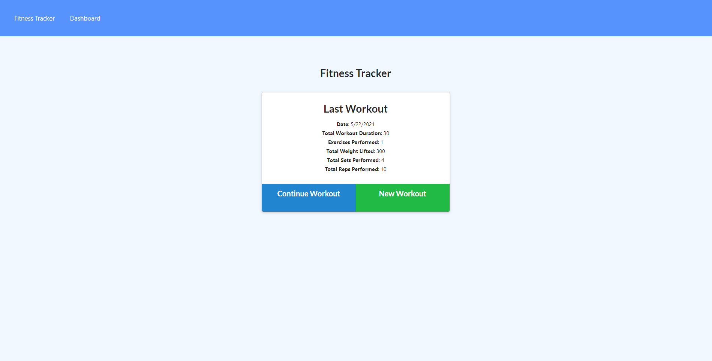
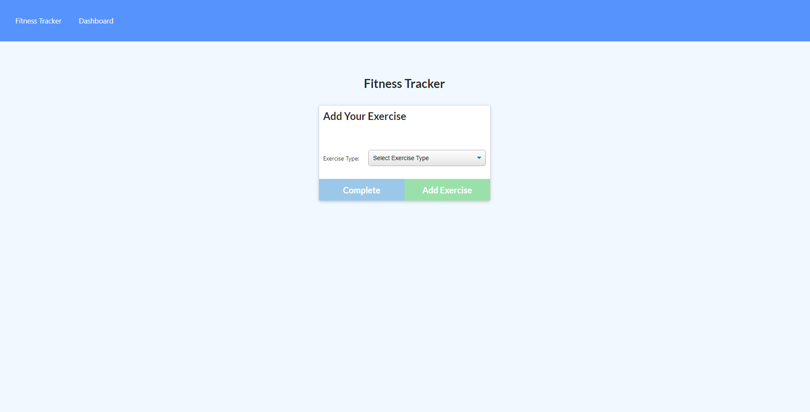
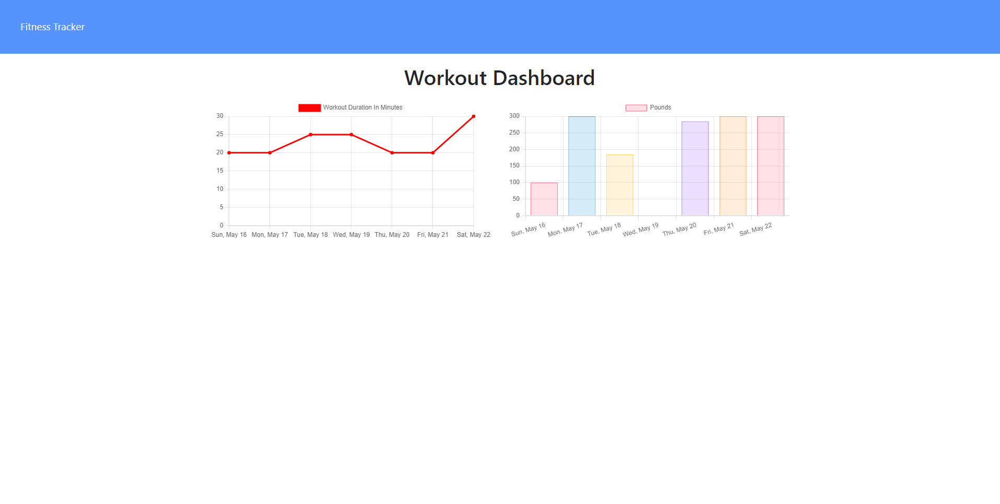

# Fitness Tracker

  This project allows users to add exercises and workouts and then displays total workout information for the last 7 days.
  
  ## Table of Contents
  
  - [License](#license)
  - [Technologies](#technologies)
  - [Dependencies](#dependencies)
  - [Contributing](#contributing)

  ## Screenshots

  

  

  
  
  ## Technologies

    * Express.js
    * Node.js 
    * Mongoose
    * MongoDB
  
  ## Dependencies

    * To install dependencies, enter npm i
  
  ## Contributing

  GitHub: https://github.com/bHutchingson